# 校园网免流教程

本校园网免流教程由[Ianlande](https://github.com/Ianlande)提出，由[BlackLotus-AL](https://github.com/BlackLotus-AL)编写

本教程使用的方案是最基础的VMess+TCP

免流原理是校园网只对IPv4流量收费，而不收取IPv6流量费用，因此让国外云服务器使用IPv4/6地址获取数据，而云服务器只使用IPv6地址向用户设备发送数据，这样不仅能够实现校园网免流，同时还能访问国外网站

### 1 Vultr VPS购买与部署

#### 1.1 账号注册

Vultr官网链接：https://www.vultr.com/

在主页即可注册Vultr账号，其中密码需至少10位，且包括英文大小写与数字

#### 1.2 账号充值

选择【**Billing**】页面，可选择通过【**Alipay**】进行充值，信息可以随便填，充值最低金额是10美元

Vultr VPS是按时间收费的，如本教程选择的服务器价格是$0.007每小时，长时间不使用的话直接删除服务器，可以节省很多费用

#### 1.3 部署VPS

选择【**Products**】页面，要部署的服务器参数如下

服务器类型：Cloud Compute

服务器地址：Tokyo（Japan）

服务器系统：Debian 9 x64

服务器配置：$5/month

**附加功能：Enable IPv6（最关键的操作，一定要记得勾选）**

等待系统安装，大概需要1分钟时间，状态显示**Running**就说明部署好了

点【**Cloud Instance**】即可查看服务器详细信息

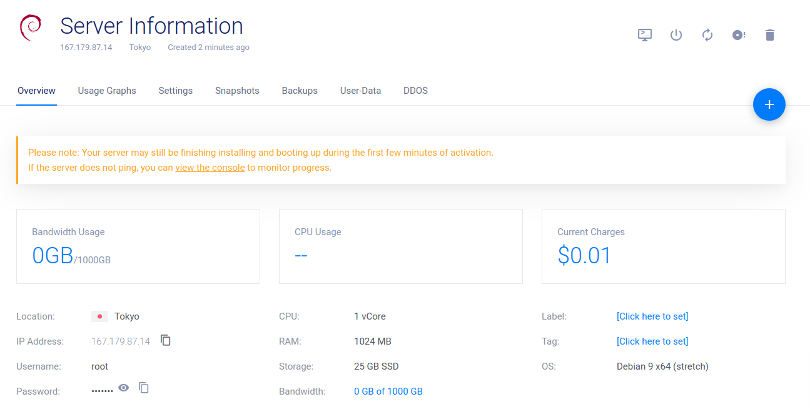

### 2 部署V2Ray服务器端

#### 2.1 安装Xshell

下载[Xshell绿色版](http://www.xitongzhijia.net/soft/158121.html)，解压后打开**Xshell.exe**即可使用，下载时建议选择普通下载地址

#### 2.2 连接服务器

点击【**新建会话**】，输入服务器IP，然后点击【**连接**】

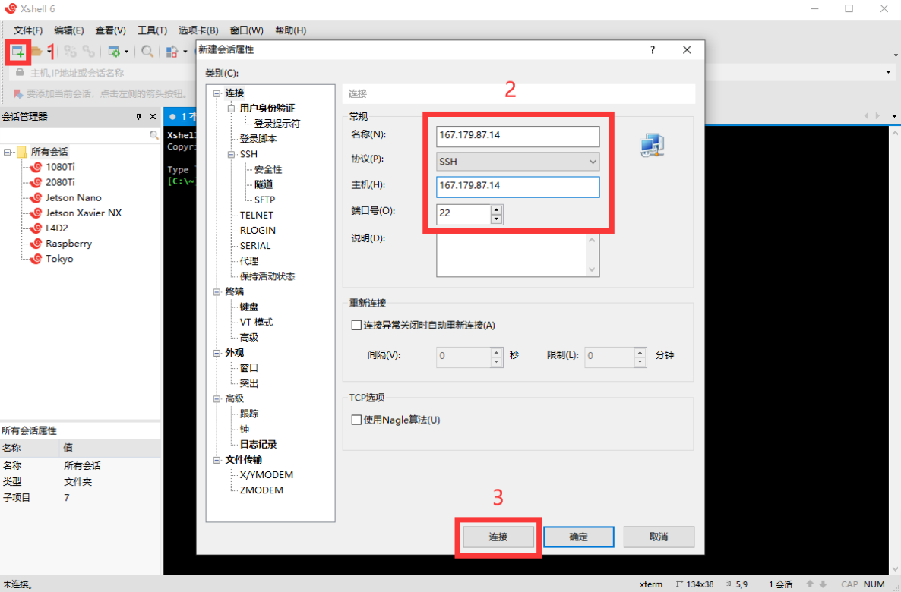

点击【**接受并保存**】

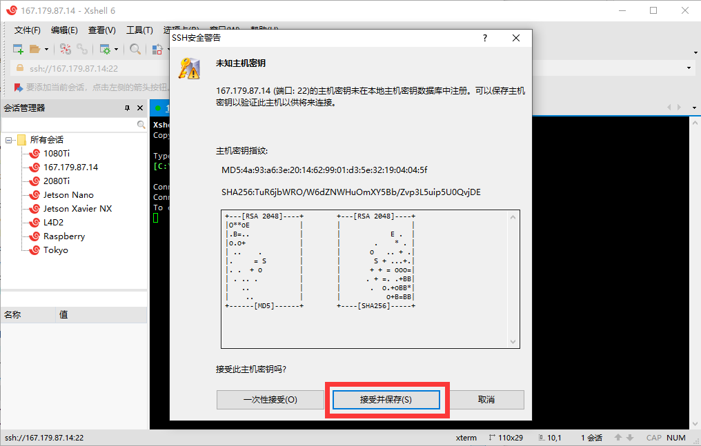

用户名输入"**root**"，并勾选【**记住用户名**】

输入密码，并勾选【**记住密码**】

服务器IP地址、用户名、密码均可以从上述提到的服务器详细信息页面获取，而且一键复制非常方便

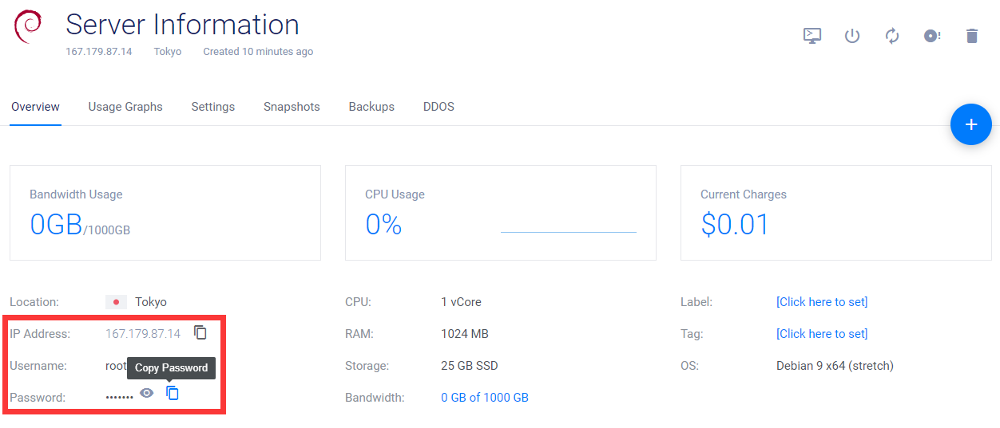

#### 2.3 安装V2Ray

运行这行代码即可一键安装V2Ray

bash <(curl -s -L https://git.io/v2ray.sh)

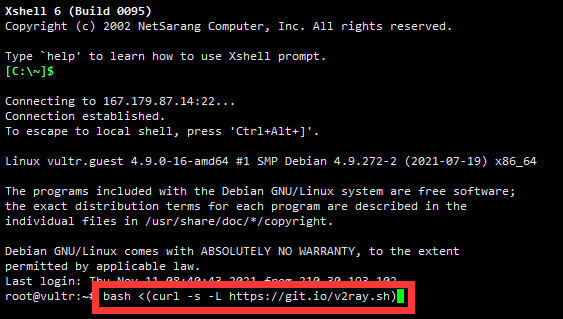

输入"**1**"启动安装

之后的配置选项直接全部回车选择默认选项

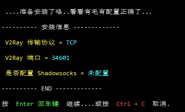

输入"**v2ray url**"生成**VMess URL**链接，这段链接很重要，之后在V2Ray客户端配置时要用到

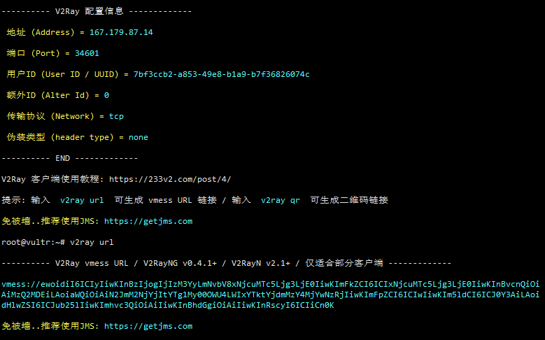

### 3 部署[v2rayN](https://github.com/2dust/v2rayN)客户端（Windows）

#### 3.1 安装v2rayN

从[v2rayN](https://github.com/2dust/v2rayN/releases)下载v2rayN-Core客户端，如当前最新正式版本的下载地址：

https://github.com/2dust/v2rayN/releases/download/4.20/v2rayN-Core.zip

下载v2rayN-Core.zip并解压，运行x2rayN.exe即可打开客户端

#### 3.2 连接V2Ray服务器端

左上角选择【**服务器**】，再选择【**添加VMess服务器**】

先复制之前导出的**VMess URL**链接，然后点击【**从剪贴板导入URL**】

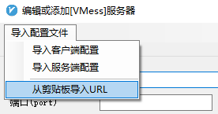

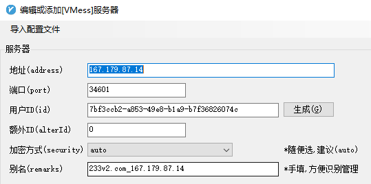

打开Vultr服务器详细信息页面，复制IPv6地址

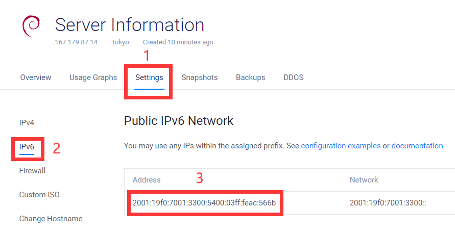

然后在地址这里将IPv4地址更换成刚刚复制的IPv6地址

点击【**确定**】，之后下方就会显示启动服务的信息

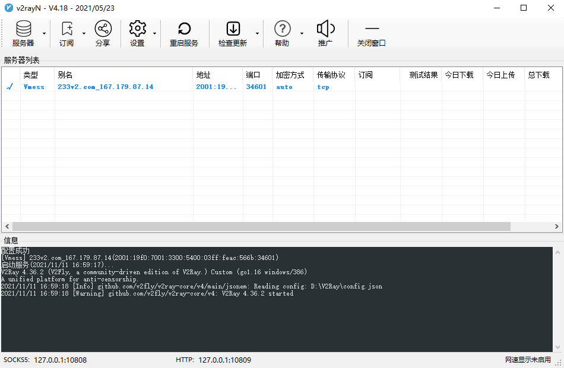

测试连接延迟，测试结果有返回时间信息即说明服务器正确启动

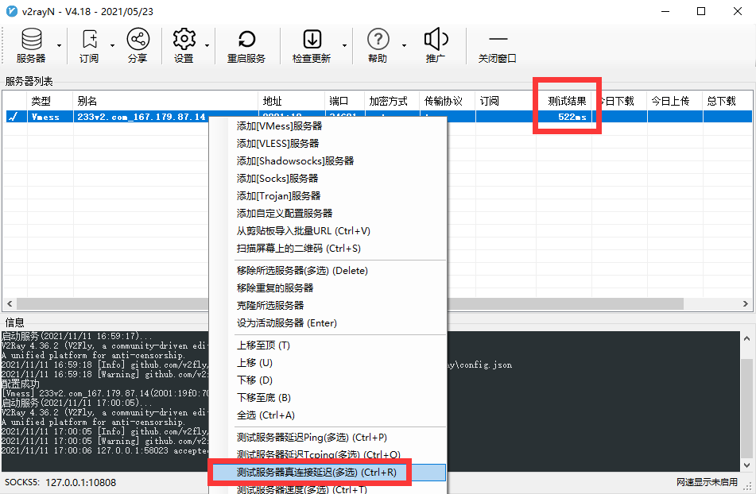

右键v2rayN图标，启动【**自动配置系统代理**】，v2rayN图标变红，快上[Google](https://www.google.com/)测试一下效果吧

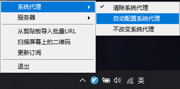

### 4 部署[Qv2ray](https://github.com/Qv2ray/Qv2ray)客户端（Ubuntu）

**👈To Be Continued**

### 5 部署[v2rayNG](https://github.com/2dust/v2rayNG)客户端（Android）

**👈To Be Continued**

### 6 进阶配置

参考[自建v2ray服务器教程](https://github.com/Alvin9999/new-pac/wiki/%E8%87%AA%E5%BB%BAv2ray%E6%9C%8D%E5%8A%A1%E5%99%A8%E6%95%99%E7%A8%8B)，包括以下7种方案：

1️⃣ **VLESS+TCP+TLS**

2️⃣ **VLESS+TCP+XTLS**

3️⃣ **VLESS+WS+TLS**

4️⃣ **VMess+TCP+TLS**

5️⃣ **VMess+WS+TLS**

6️⃣ **Trojan**

7️⃣ **Trojan-Go WS**

